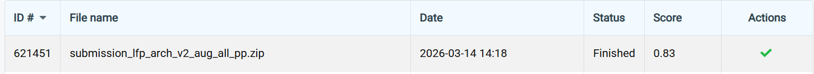
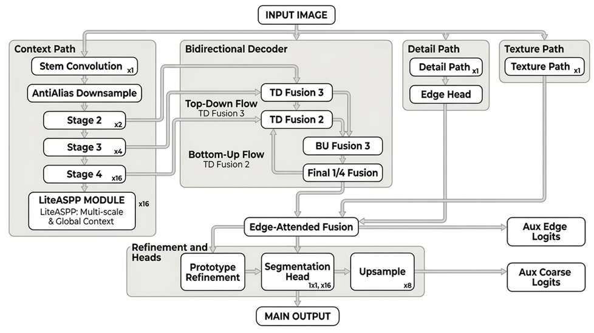
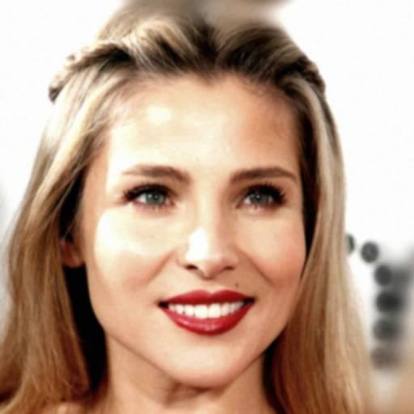
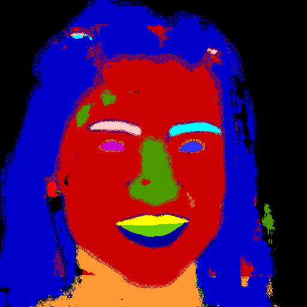
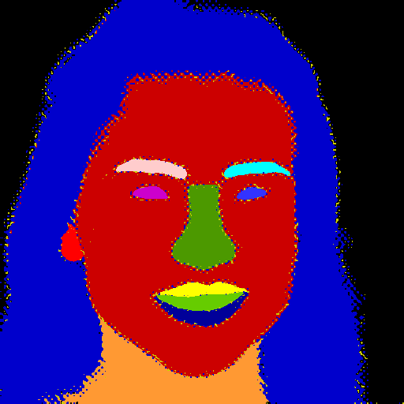
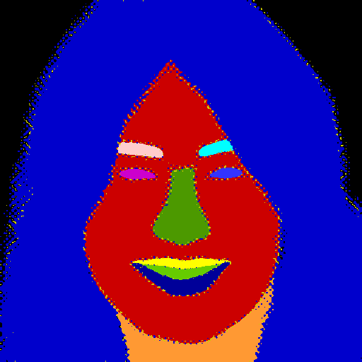

# AI6126 CelebAMask Face Parsing

This repository contains my work for the CelebAMask Face Parsing project as part of NTU AI6126 Advanced Computer Vision class.

The goal of this mini challenge is to design and train a face parsing network using the CelebAMask-HQ Dataset. A mini-dataset consisting of 1000 training and 100 validation pairs of
images is used, where both images and annotations have a resolution of 512 x 512.

The performance of the network will be evaluated based on the F-measure between the
predicted masks and the ground truth of the test set.

---

## Results

The final **Lite-Face Parser** model with **1,820,207 parameters** achieves an **F1-score of 0.83** on the test set.



---

## Methodology

### Baseline: SRResNet

The baseline adapts SRResNet for semantic segmentation. It avoids all downsampling (no strided convolutions or pooling), maintaining the full 512×512 resolution throughout to preserve boundary detail. The backbone is a sequence of 16 residual blocks followed by dilated convolutions (rates 2, 4, 8) for a wider receptive field, and a multi-stage decoder head for 19-class logit output.

### Data Augmentation

Several spatial and pixel-level augmentation strategies were compared. Rotation and Shifting gave the largest gains (~27% improvement), and Contrast was also beneficial. Horizontal Flip slightly hurt performance due to asymmetric class labels (left vs. right eye). The final pipeline uses **Rotation + Shifting + Contrast**.

| Augmentation Strategy | F-score |
|---|---|
| Baseline (No Augmentation) | 0.4599 |
| Horizontal Flip | 0.4581 |
| **Rotation** | **0.5762** |
| **Shifting** | **0.5853** |
| **Contrast** | **0.5847** |
| Brightness Adjustments | 0.5387 |

*10 epochs, batch size 4, 256×256 input.*

### Loss Function

Standalone Dice, Focal, and Boundary-Aware losses hurt performance on this small dataset due to training instability. Combining all three with Cross-Entropy yielded the best result. The final pipeline uses the **Hybrid CE + Dice + Boundary** loss.

| Loss Function | F-score |
|---|---|
| Baseline (Cross-Entropy) | 0.5536 |
| Dice Loss | 0.1916 |
| Focal Loss | 0.5504 |
| Boundary-Aware Loss | 0.4744 |
| **Hybrid (CE + Dice + Boundary)** | **0.6253** |

*10 epochs, batch size 4, 256×256 input.*

### Architecture: Lite-Face Parser

The **Lite-Face Parser (LFP)** is a lightweight multi-path segmentation architecture with three parallel paths:

- **Context Path** — Inverted Residual Bottlenecks + LiteASPP for multi-scale global context
- **Detail Path** — shallow branch at 1/4 resolution for boundary-sensitive edges
- **Texture Path** — shallow branch at 1/4 resolution for surface patterns

These paths are integrated via a **Weighted Bi-Fusion Decoder** with learnable fusion weights, a **Prototype Refinement** module for class-aware attention, and **Edge-Guided Fusion** for sharp boundary transitions.



#### Quantitative Comparison

| Model | Parameters | F-score |
|---|---|---|
| SRResNet | 1,428,762 | 0.6357 |
| **Lite-Face Parser** | **1,820,207** | **0.7429** |

*30 epochs, 512×512 input, hybrid loss, with data augmentation.*

#### Qualitative Comparison

The LFP model produces significantly cleaner masks with sharper boundaries compared to the SRResNet baseline, which suffers from blotching and fragmented predictions.

| Input Image | SRResNet | Lite-Face Parser |
|:---:|:---:|:---:|
|  |  |  |

### Post-processing

A post-processing pipeline (small component removal + 3×3 majority filter) eliminates high-frequency noise and smooths mask boundaries.

| Input Image | Before Post-processing | After Post-processing |
|:---:|:---:|:---:|
|  |  |  |

---

## Setup Instructions

1. Clone the repository

```bash
git clone https://github.com/Ardacandra/ai6126_CelebAMask_face_parsing.git
cd ai6126_CelebAMask_face_parsing
```

2. Set up the conda environment

```bash
conda create -n ai6126_CelebAMask_face_parsing python=3.10 -y
conda activate ai6126_CelebAMask_face_parsing
```

3. Install dependencies

```bash
pip install torch torchvision --index-url https://download.pytorch.org/whl/cu124
pip install -r requirements.txt
```

4. Prepare the CelebAMask-HQ Dataset

Download the dataset and store in `./data` folder. The format should be as follows:

```
data/
├── train/
│   ├── images/
│   └── masks/
└── val/
    └── images/
```

Try running the visualization script to make sure the dataset is stored correctly:

```bash
python visualize_samples.py
```

## Training and Evaluation

1. Set `output.run_id`, `model.name`, and other training hyperparameters in `config.yaml`.
2. (Optional) Generate augmented dataset :

```bash
python src/data_augmentation.py
```

Each training image is assigned several augmentation methods in round-robin sequence (and the original sample is also kept).

This creates:

- `data/train_aug/images/*.jpg`
- `data/train_aug/masks/*.png`

To train using the augmented dataset, set this in `config.yaml`:

```yaml
data:
    augmentation:
        use_train_aug: true
```

3. Train:

```bash
python src/train.py
```

4. Generate validation predictions:

```bash
python src/evaluate.py
```

5. Prepare submission package (matches `data/sample-submission/masks` format):

```bash
python prepare_submission.py
```

This creates:

- `out/<run_id>/submission/masks/*.png`
- `out/<run_id>/<run_id>_submission.zip`

6. (Optional) Apply postprocessing from `config.yaml` (`postprocessing.method`):

```bash
python src/postprocessing.py
```

This creates `out/<run_id>/submission_<method>/masks/*.png` and `out/<run_id>/<run_id>_post_<method>_submission.zip`

## Grid Search

Use `grid_search.py` to run multiple training combinations in one command. It varies:

- `training.image_size`
- `training.batch_size`
- `training.learning_rate`
- `training.scheduler` (`reduce_on_plateau` or `none`)
- `training.loss.ce_dice_boundary` weights/params

Example:

```bash
python grid_search.py \
    --image-sizes 384,512 \
    --batch-sizes 4,8 \
    --learning-rates 0.001,0.0005 \
    --schedulers reduce_on_plateau,none \
    --ce-weights 1.0 \
    --dice-weights 1.0 \
    --boundary-weights 1.0,1.5 \
    --dilations 3,5 \
    --dice-smooth-values 1.0 \
    --skip-completed
```

## Running The Packaged Submission

The repository also includes a ready-to-run submission package in `submission/submission_lfp_arch_v2_aug_all_pp/`.

Install its dependencies and run inference on a folder of test images with:

```bash
pip install -r submission/submission_lfp_arch_v2_aug_all_pp/solution/requirements.txt
python submission/submission_lfp_arch_v2_aug_all_pp/solution/run_folder.py \
    --input-dir data/test/images \
    --output-dir submission/submission_lfp_arch_v2_aug_all_pp/masks \
    --weights submission/submission_lfp_arch_v2_aug_all_pp/solution/ckpt.pth \
    --run-script submission/submission_lfp_arch_v2_aug_all_pp/solution/run.py
```

This writes one `.png` parsing mask per input image into `submission/submission_lfp_arch_v2_aug_all_pp/masks/`.
